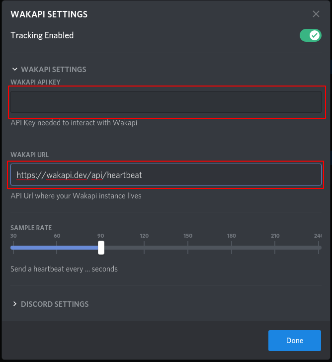
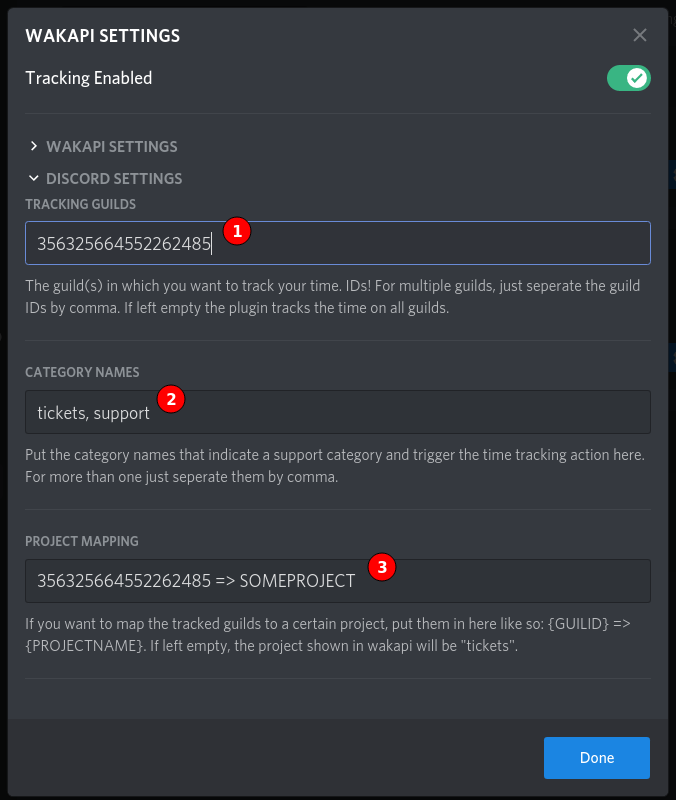

# Wakapi-Discord
[Wakapi](https://github.com/muety/wakapi) integration in the [BetterDiscord](https://github.com/rauenzi/BetterDiscordApp) client. Enables you to track the time you spend answering support tickets.

Time spent in support tickets will be logged under the language _"Tickets"_.

## Installation

- Copy plugin the plugins folder of BetterDiscord.
- Customize the plugin based on your needs (if needed)
- Open Discord and view any of the opened tickets.

## Configuration

### Wakapi Settings



Fill in you Wakapi API Key and Url in these fields. If you supply no API Key, the plugin won't start.

The sample rate is the amount of seconds that pass between each heartbeat that is sent to Wakapi.
### Discord Settings


1. Place the ID of the server in where you want to track your ticket time in here. For multiple guilds, just seperate the IDs by comma.
2. These are the names of the categories in which you want to track your time. If your tickets are under the "support" categoiry, you would have to put "support" here. Mulitple value allowed.

3. Project mapping. If you want to map the time spent in a tracked guild to a project, put the id in this text area followed by `=>` and the projectname. As with all other settigs, you can enter multiple values, seperated by comma


## Development

- Clone the repository
```console
git clone https://github.com/LoneDev6/Wakapi-Discord.git
```

- Initialize your dev environment
```console
npm run dev:init
``` 

- Do all your changes inside of ./plugins/Wakapi

- To build the plugin, run 
```console
npm run dev:build
```
